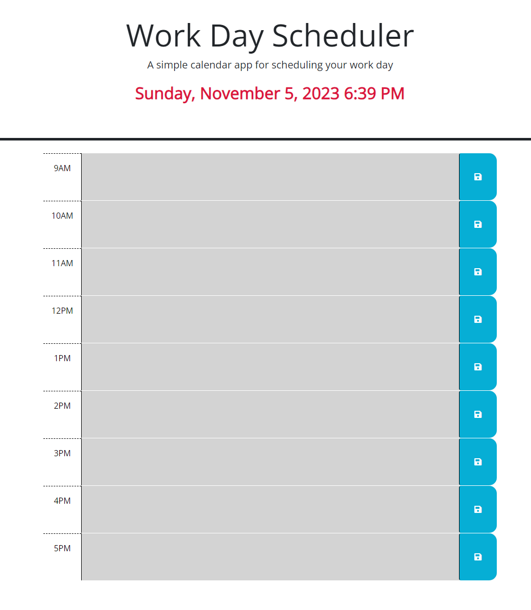

# Module5_challenge- Intro

```
- Welcome to your new Daily Planner! The current date and time is present on the top of the screen and is easily visible for you! I added to the CSS stylings to make this element stand out.

- Below the date you will find an hourly table ranging from 9am-5pm. Each time-slot has the ability for the user to write down important memos corresponding to when they take place.

- When you click the 'save' button the information noted into the planner is saved for future use. When you reload the page the information entered will be readily available. 

- There is color coding associated with the time-slots. The times that are in the past are grey, the current hour slot you are in is colored red, and all future slots are colored green!

-Enjoy!
```
# Given Criteria to meet:
```md
-GIVEN I am using a daily planner to create a schedule.


-WHEN I open the planner, THEN the current day is displayed at the top of the calendar

-WHEN I scroll down, THEN I am presented with timeblocks for standard business hours of 9am&ndash;5pm

-WHEN I view the timeblocks for that day, THEN each timeblock is color coded to indicate whether it is in the past, present, or future

-WHEN I click into a timeblock, THEN I can enter an event

-WHEN I click the save button for that timeblock, THEN the text for that event is saved in local storage

-WHEN I refresh the page, THEN the saved events persist

```

# URL to the website:

https://waltscode.github.io/Module5_challenge/ 


# Screenshot of the website can be found below:


